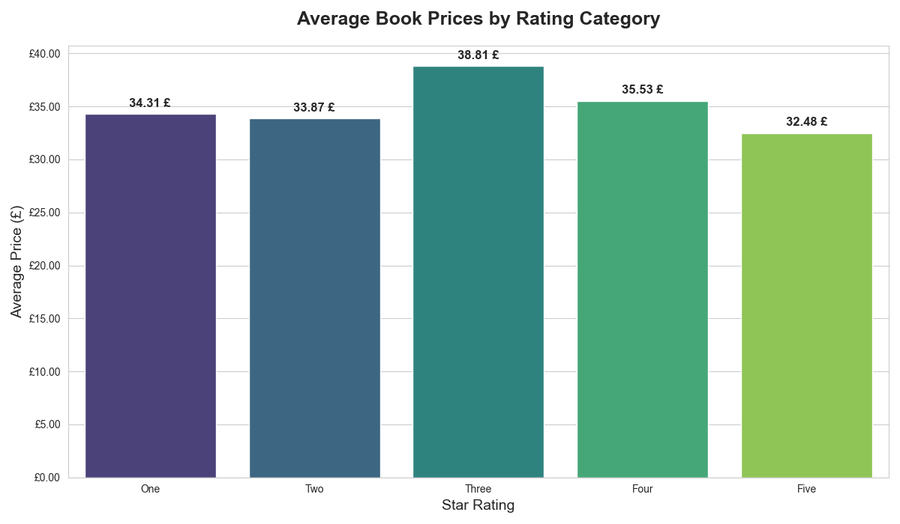

Web Scraping & Book Market Analysis

Project Overview
This project is an automated data pipeline that extracts, cleans, and analyzes book data from an e-commerce store. It demonstrates the ability to collect large datasets from the web and transform them into actionable business insights.

Tech Stack
    Python (BeautifulSoup4, Requests) - Web scraping and crawling.
    Pandas - Data cleaning and statistical aggregation.
    Seaborn & Matplotlib - Data visualization and trend analysis.
    Excel - Professional automated reporting.

Key Features
    Multi-page Crawler: Automatically navigates through multiple category pages to collect a comprehensive dataset.
    Smart Data Cleaning: Extracts numerical prices from messy HTML strings and maps text-based ratings (e.g., "Three") to numerical values (3.0) for analysis.
    Statistical Analysis: Calculates average prices per rating category to find correlations between product quality and cost.
    Visual Dashboard: Generates a professional bar chart (Viridis palette) showing price distributions.

Repository Structure
    `scraper.py` - The main Python script.
    `Mega_Books_Report.xlsx` - Final Excel report with raw data and aggregated analysis.
    `average_price_by_rating.png` - Data visualization dashboard.

Sample Visualization

Skills Demonstrated
- Web Crawling & Scraping
- Data Wrangling (Pandas)
- Exploratory Data Analysis (EDA)
- Automated Reporting